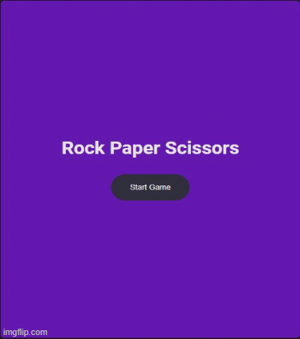

<h1 align="center">
   
  
   
  A simple Rock, Paper, Scissors game implemented in HTML, CSS, and JavaScript.
   
</h1>

  

## Key Features

- **Player vs Computer:** Play against the computer with randomly generated choices.
<!-- - **Responsive Design:** Enjoy the game on various devices and screen sizes. -->
- **Score Tracking:** Keep track of the player's and computer's scores.
- **Game Results:** Display the results of each round and the overall winner.
- **Reset Game:** Easily reset the game to play again.

## How to Play

1. Open the `rock_papaer_Scissors.html` file in your web browser.
2. Click start button to start game.
3. choose your move
3. The computer will randomly choose its move.
4. The result of the will be displayed, and the scores will be updated.
5. Continue playing until you decide to reset the game.

## Technologies Used

- HTML
- CSS
- JavaScript